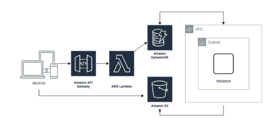

# Fovus-Challenge

This project consists of two sets of code:
1. **Frontend React Code**: Located under the current directory.
2. **Server-side Code**: Utilizing AWS CDK and SDK, deployed in AWS Lambda and EC2 instance. Server Side not needed to run the application. It is just for the review.

## Getting Started

To run the application, follow these steps:

1. Clone the repository.
2. Install dependencies:
   ```bash
   npm install
   ```
3. Start the application:
   ```bash
   npm start
   ```

### Prerequisites

Ensure you have the following software installed:

- [Node.js](https://nodejs.org/en/download/)
- [AWS SDK](https://aws.amazon.com/sdk-for-node-js/)
- [nanoid](https://www.npmjs.com/package/nanoid)

## Usage

Once the application is running:

1. Open your browser and navigate to [http://localhost:3000/](http://localhost:3000/).
2. You will be presented with a form containing a text input and a file input.
3. Enter text in the text input field.
4. Choose a file using the file input field.
5. Click the submit button.

# Architecture Overview

## Frontend Page

## AWS Infrastructure

### S3 Bucket
Initially, the S3 bucket contains `server.js`, which is executed when the EC2 instance starts via Lambda.

### Lambda and EC2 Interaction
Upon clicking submit, the following process is initiated:

### DynamoDB Usage
Data is stored and retrieved from DynamoDB. Images below depict the DynamoDB state at the start and end of the application.

### S3 Bucket at the End
The S3 bucket reflects the final state after the process completes.

## Server-side Code

The `server.js` code, available in the `server-side-code` folder, retrieves data from DynamoDB, downloads the input file from S3, appends input text, uploads the file back to S3, and updates the item by adding the `output_file_path` variable.
